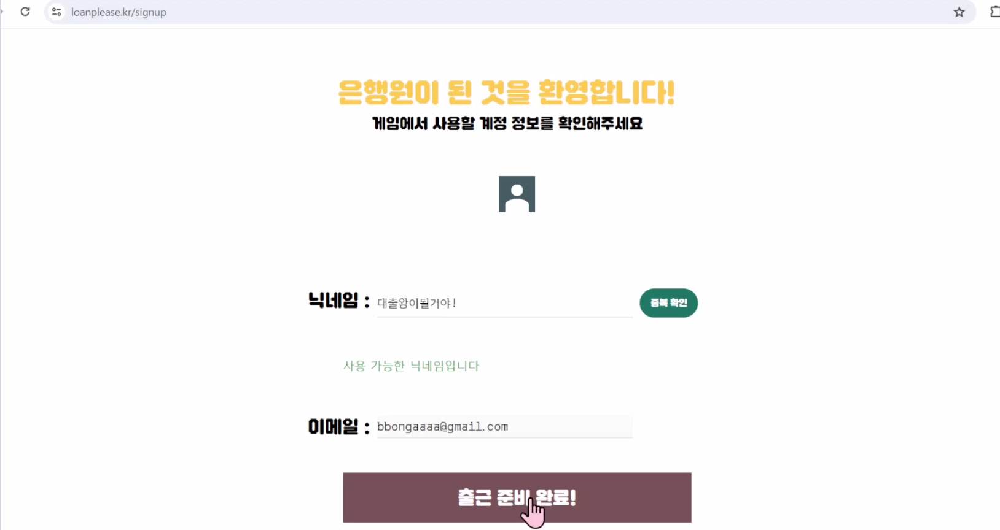

# Loan Please(론플리즈) 💰


## 목차

- [서비스 개요](#서비스-개요)
- [팀원소개](#팀원소개)
- [기술스택](#기술스택)
- [시스템 아키텍처](#시스템-아키텍처)
- [기능소개](#기능소개)
- [프로젝트 산출물](#프로젝트-산출물)
- [컨벤션](#컨벤션)


## 서비스 개요

> 
> **Loan Please(론플리즈) 💰**
>
> 신용도 예측 AI 모델을 활용한 게임형 대출 프로세스 교육 서비스
>
> 
> 📌 2024.04.08 ~ 2024.05.24 (7주)
>
>
>신파일러(금융이력부족자)시라고요?
>
>신파일러는 어떻게 대출을 받으면 좋을까요?
>
>나의 비금융 데이터가 신용 평가에 활용된다면?
>
>
>신파일러에게 더 많은 금융 기회를 제공하고,
>신용도와 이와 관련된 적합한 대출 상품을 추천하면서
>대출이 어떤 방식으로 이루어지는지 경험해보세요!
>
>
>은행원이 되어 직접 고객에게 대출 상품을 판매하고,
>다양한 대출 상품으로 더 많은 고객에게
>대출 기회를 제공해보세요!
>
>그럼, 론 플리즈의 은행원이 되어볼까요?


## 팀원소개
<div align="middle">
<table>
    <tr>
        <td height="140px" align="center"> <a href="https://github.com/SeLino98">
             <br><br> 👑 김인호  </a><br>(Back-End)<br></td>
        <td height="140px" align="center"> <a href="https://github.com/nks211">
             <br><br> 💫 김민우 </a>  <br>(Front-End)<br></td>
        <td height="140px" align="center"> <a href="https://github.com/BaekJaehee">
             <br><br> 🐼 백재희 </a> <br>(Front-End)<br></td>
        <td height="140px" align="center"> <a href="https://github.com/kipperhr">
             <br><br> 🍎 이민수</a>  <br>(Front-End)<br></td>
        <td height="140px" align="center"> <a href="https://github.com/joongwonLee">
             <br><br> 🕶 이중원 </a><br>(Back-End)<br></td>
        <td height="140px" align="center"> <a href="https://github.com/Int-TRUE">
             <br><br> 🍔 정수진  </a><br>(Back-End)<br></td>
        <td height="140px" align="center"> <a href="https://github.com/cnh12">
             <br><br> 💚 조남현 </a> <br>(Back-End)<br></td>
    </tr>
</table>
</div>


## 기술스택


<div align="middle">

### **프론트엔드**


**Language |** Javascript

**Framework |** React: 18.2.0

**IDE |** VsCode : 1.85.1

**Library |** zustand

<br>
<br>

</div>


<div align="middle">

### **백엔드**

 


**Language |** Oracle OpenJDK version 21.0.2

**Framework |** Spring Boot 3.2.3

**Data(RDBMS) |** MySQL 8.0.36, Redis 7.2.4


<br>
<br>

</div>


<div align="middle">

### **AI**


**Language |** Python 3.9

<br>
<br>

</div>


<div align="middle">

### **인프라**


**Server |** AWS EC2 Ubuntu 20.04.6 LTS, GitLab, Jenkins(JDK 17), Docker

<br>
<br>

</div>


## 시스템 아키텍처


## 기능소개
> ### ✨ 구글 회원가입/로그인
<br>


<br>

- 구글 로그인으로 회원가입 및 로그인 진행

<br>
<br>

> ### ✨ 랭킹 확인
<br>

<br>

- 전체 랭킹 확인
- 친구 랭킹 확인

<br>
<br>

> ### ✨ 상점
<br>


<br>

- 고객에게 판매할 대출 상품 구매 가능
- 아이템 구매 가능(슬롯 추가(2회 가능) / VIP실 티켓(정답 여부와 관계없이 최고 점수 획득) / 시간 연장(1분 추가) / 보호막(점수 감점 1회 방어))
- 보유 슬롯 개수만큼 원하는 대출 상품 장착 가능(기본 3개, 최대 5개)

<br>
<br>

> ### ✨ 게임
<br>

<br>

- 3분 동안 최대한 많은 대출 상품을 판매
- `다음 고객 부르기`로 다음 고객 호출
- `돌려보내기`를 누르면 추천하지 않고 보낼 수 있음(대출 준비물이 부족한 경우 점수 획득, 그렇지 않다면 감점)
- 고객의 금융 정보, 비금융 정보를 확인하여 신용도 예측 후 적합한 상품 추천
 (ex. 높은 신용 등급의 고객의 경우 저금리 대출 추천시 점수 획득량 증가)
- 신용도 예측에는 미리 학습되어 있는 AI모델이 활용됨
- 게임 중에 미리 구매한 아이템 1회 사용 가능


<br>
<br>

## 프로젝트 산출물

> **API 명세서**

[API 명세서 노션 링크](https://www.notion.so/d105/API-7a0060fc56354f8db6545051527fb4fc)


> **ERD**


 

  


> **포팅매뉴얼**


[포팅매뉴얼](./exec/)


## 컨벤션 

#### 작업 단위로 브랜치 생성

```jsx
1. 시작 전 반드시 git pull (git pull origin FE/develop) (백엔드의 경우 BE/develop)

2. 현재 브랜치 확인 ( git branch로 현재 브랜치 확인 가능 )

3. git switch FE/develop 로 'FE/develop' 브랜치로 이동

4. 'FE/develop' 브랜치로 이동 후에 하위 브랜치 생성

git checkout -b 브랜치이름

> 브랜치 이름은 FE/케밥케이스로 작성 (ex. FE/feat-example)
> 브랜치 이름 설정은 전체 컨벤션 참고

5. 작업 완료 후 현재 브랜치에 푸시하기

git add .

git commit -m "[FE][Feat] 작업내용

커밋 내용"

git push origin FE/feat-example

6. Gitlab에서 Merge Request 작성하기

파일 위치 확인 - master가 아닌 FE/develop으로 Merge하기

제목은 커밋 메시지와 비슷한 형태로 작성

[FE][Feat] 작업내용

7. 내용에는 작업한 내용을 간략하게 설명
8. 이슈 상황이 있을 경우 공유

(추후 지라-이슈 연동하면 지라 링크 올리기)

Assignee를 본인으로 하고 같은 직렬 아무에게나 Approve 받기
Approve 받고 본인이 Merge 하기
```
